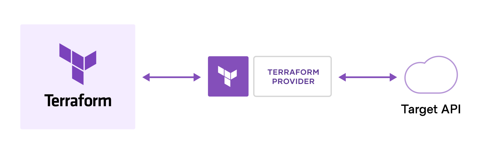

# Terraform Introduction
## 테라폼이란 무엇인가?
테라폼은 사람이 읽을 수 있는 구성 파일에서 클라우드 및 온프레미스 리소스를 모두 정의할 수 있는 코드형 인프라 도구입니다. \
일관된 워크플로우를 사용하며 수명 주기 동안 모든 인프라를 프로비저닝하고 관리할 수 있습니다.
## 테라폼은 어떻게 동작하는가?
테라폼은 API를 통해 클라우드 플랫폼 및 기타 서비스에서 리소스를 생성하고 관리합니다.

### Terrafrom Workflow Step
* **Write:** 다양한 클라우드 제공자 및 서비스에 걸쳐 리소스를 정의합니다.
* **Plan:** 테라폼은 기존의 인프라 및 사용자의 구성에 기반해 생성, 업데이트, 삭제할 인프라를 설명하는 실행 계획을 작성합니다.
* **Apply:** 승인 시 테라폼은 리소스 종속성을 고려하여 제안된 작업을 올바른 순서로 수행합니다.

## 왜 테라폼을 사용하는가?
### 모든 인프라 관리
---
[Terraform Registry](https://registry.terraform.io/)에서 다양한 플랫폼 및 서비스에 대한 provider를 찾을 수 있습니다. \
테라폼은 인프라에 대한 [변하지 않는 접근 방식](https://www.hashicorp.com/resources/what-is-mutable-vs-immutable-infrastructure)을 취하여 서비스 및 인프라를 업그레이드, 수정하는 복잡성을 줄입니다.
### 인프라 추적
---
테라폼은 계획을 생성하고 인프라를 수정하기 전에 승인을 요청합니다.\
[상태 파일](https://www.terraform.io/language/state)에서 실제 인프라를 추적합니다. \
테라폼은 상태 파일을 사용하여 구성과 일치하도록 인프라에 대한 변경 사항을 결정합니다.
### 변경 자동화
---
테라폼 구성 파일은 선언형이고 인프라의 최종 상태를 설명합니다.\
테라폼이 기본 로직을 처리하기 떄문에 리소스를 생성하기 위해 단계별 지침을 작성할 필요가 없습니다. \
테라폼은 리소스 종속성을 결정하기 위해 리소스 그래프를 빌드하고 병렬로 비의존 리소스를 생성하거나 수정합니다.
### 구성 표준화
---
테라폼은 인프라 컬렉션을 정의하는 [모듈](https://www.terraform.io/docs/language/modules)이라는 재사용 가능한 구성 요소를 지원, 시간을 절약합니다.